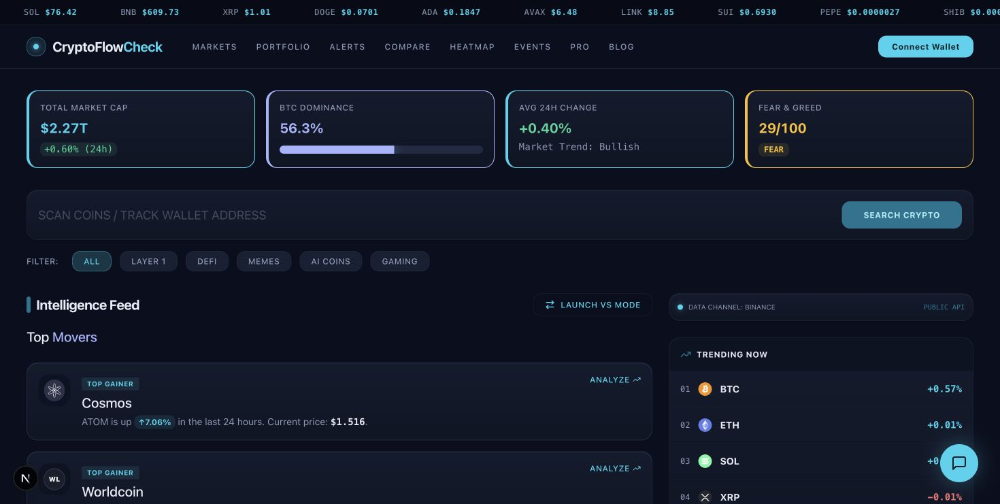
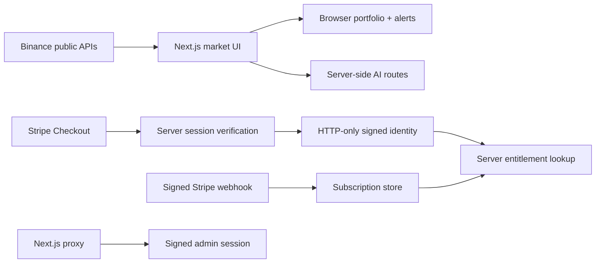

# CryptoFlowCheck

A crypto market-intelligence dashboard built around public exchange data, deterministic portfolio math, guarded AI features, and a security-conscious Stripe subscription flow.

[](https://github.com/yigiterturk-dev/cryptoflowcheck/actions/workflows/ci.yml)
[](tests)
[](docs/showcase-audit.md)
[](LICENSE)

> Portfolio status: lint, 35 automated tests, the Next.js production build, and the dependency audit are verified locally and repeated by public CI. Live Stripe settlement, OpenAI generation, and external exchange availability require owner-managed credentials or services and are documented as deployment gates.

## Product evidence

[](docs/screenshots/home-desktop.png)

Current default-branch UI running against the public market-data adapter. Prices in the capture are a point-in-time snapshot, not a performance or availability claim.

## What it demonstrates

- **Public market data:** Binance REST/WebSocket price paths, historical candles, 24-hour change, volume, comparisons, heatmaps, and fear/greed context.
- **Local portfolio tools:** holdings, cost basis, live P&L, drawdown alerts, threshold watches, and analysis history stay in browser storage.
- **Fail-closed admin auth:** HMAC-signed, expiring, HTTP-only session cookies; both the signing secret and password hash are required.
- **Verified subscription identity:** Stripe Checkout returns are verified server-side before an HTTP-only, HMAC-signed identity token is issued.
- **Independent entitlement check:** a verified identity is still looked up in the subscription store; neither a client cookie nor UI state grants Pro access by itself.
- **Export hardening:** CSV formula-injection neutralization covers `=`, `+`, `-`, `@`, tab, carriage return, and quoting edge cases.
- **Optional AI:** model-backed analysis and brief generation disable cleanly when no OpenAI key is configured.

## Architecture



The animated terminal scanner is deliberately labeled **SIMULATED**. It is a presentation component, not an on-chain transaction feed. Market prices and candles come from the public data adapters described above.

## Security work captured in this repository

- Upgraded from a vulnerable Next.js 15 release candidate stack to Next.js 16.3 and stable React 19.
- Removed the built-in admin password fallback; missing configuration now returns `503`.
- Migrated deprecated middleware to the Next.js 16 proxy convention.
- Added signed subscription identity with tamper and expiry tests.
- Changed Checkout success handling so typing or forging a paid email cannot directly create a Pro identity.
- Kept Stripe webhook signature verification on the raw request body and rejected missing configuration.
- Rate-limit identity prefers proxy-derived addresses and validates IP shape before keying counters.
- Assistant-generated comparison links are reconstructed from allowlisted exchange IDs; unsafe destinations render as plain text.
- Checkout email validation is bounded and linear-time rather than dependent on a backtracking regular expression.

## Test coverage

The 35-case suite covers:

- portfolio P&L, aggregate totals, missing prices, drawdown alerts, and zero-cost edge cases;
- CSV formula injection and RFC-compatible quoting;
- Stripe-style signature tampering, wrong secrets, timestamps, and malformed headers;
- subscription identity signing, tampering, expiry, and missing-secret failure;
- tier resolution, normalization, cancellation, anonymous access, and forged values.
- bounded email validation and fail-closed handling of script, external, unknown, and malformed comparison links.

## Run locally

Requirements: Node.js 24+ and npm.

```bash
git clone https://github.com/yigiterturk-dev/cryptoflowcheck.git
cd cryptoflowcheck
npm ci
cp .env.example .env.local
npm run dev
```

Quality gates:

```bash
npm run lint
npm test
npm run build
npm audit
```

Public market screens can run without private credentials. Stripe, admin, cron, and OpenAI routes fail closed or disable their optional behavior when their corresponding server-only values are absent.

## Honest scope

- The current subscription store is JSON-file-backed and suitable only for a single persistent instance. Production/serverless deployment needs PostgreSQL, Redis, or another durable shared store.
- Rate-limit counters are process-local; multi-instance deployments need a shared limiter.
- Portfolio, watch, and analysis-history records are browser-local, not synchronized user accounts.
- Checkout and webhook code paths are unit/audit reviewed but were not exercised against an owner Stripe test account in this audit.
- The app provides informational tooling, not investment advice or trading guarantees.

See [.env.example](.env.example), [SECURITY.md](SECURITY.md), and [docs/showcase-audit.md](docs/showcase-audit.md).

## Stack

Next.js 16 · React 19 · TypeScript · Tailwind CSS · Framer Motion · Lightweight Charts · Binance APIs · Stripe · OpenAI (optional)

## License

[MIT](LICENSE)
